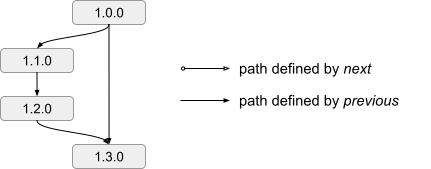
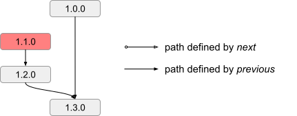

# Cincinnati #

Cincinnati is the successor to the [Omaha update protocol][google-omaha]. It describes a particular method for representing transitions between releases of a project and allowing a client to perform automatic updates between these releases.

[google-omaha]: https://github.com/google/omaha/blob/v1.3.33.7/doc/ServerProtocolV3.md

## Goals ##

* used by OpenShift for updates to both the entire stack and individual components
* used in both online and offline environments
* centralize control of OpenShift cluster rollouts and allow release SRE to provide fine-grained version control under the control of automation
* allow administrators to implement their own rollout policies for their clusters


## Update Graph ##

Cincinnati uses a [directed acyclic graph][dag] (DAG) to represent the valid updates. Each node in the graph is a release payload and each edge is a valid transition. The Graph Builder is responsible for iterating over the set of releases and building a DAG that can be queried.

Release payloads within Cincinnati contain a small JSON-formatted metadata document which declares the following information about the payload:

|   Key    | Optional | Description                                                                             |
|:--------:|:--------:|:----------------------------------------------------------------------------------------|
|   kind   | required | the document type - Must be `cincinnati-metadata-v0`                                    |
| version  | required | the version of the release in the current payload                                       |
| previous | optional | the list of valid previous versions <sup>[1](#1)</sup>                                  |
|   next   | optional | the list of valid next versions <sup>[2](#2)</sup>                                      |
| metadata | optional | an opaque object that allows a release to convey arbitrary information to its consumers |

It should be noted that the metadata documents are capable of forming cycles. Before accepting nodes into the graph, the Graph Builder will verify that there are no cycles introduced.

<a name="1"><sup>1</sup></a>Transitions are allowed from these previous versions to this version.<br>
<a name="2"><sup>2</sup></a>Transitions are allowed from this version to these next versions. This is typically only used for versions that need to be inserted into the graph after the fact since it’s not usually known what the next versions are going to be.

[dag]: https://en.wikipedia.org/wiki/Directed_acyclic_graph


### Examples ###

An example of this metadata document can be seen here:

```json
{
	"kind": "cincinnati-metadata-v0",
	"version": "1.1.0",
	"previous": ["1.0.0"],
	"metadata": {
		"kind": "security"
	}
}
```

A simple example of this directed acyclic graph can be seen in Figure 1 (see [this script](../../hack/graph.sh) for generating a [Graphviz DOT][dot] rendering from Cincinnati JSON). In this example, four versions were released (`1.0.0`, `1.1.0`, `1.2.0`, and `1.3.0`).

<figure align="center">
  
  <figcaption>Figure 1: A visualized DAG with four releases</figcaption>
</figure>

After releasing `1.1.0`, it is discovered that there is a critical bug and this version is subsequently flagged as degraded.
Update paths which lead into the degraded release are removed to prevent clients from upgrading to the degraded release.
Because of this, it will not be possible for clients who are currently running `1.0.0` to update to `1.2.0`.

<figure align="center">
  
  <figcaption>Figure 2: A visualized DAG with four releases, one of which is degraded</figcaption>
</figure>

In order to allow the transition mentioned above, a new version, `1.1.1`, can be released (an alternative approach would be to add an edge directly from `1.0.0` to `1.2.0`, which you could do by updating the metadata for either of those nodes, next or previous, respectively).
In order to insert itself into the graph, it will need to make use of both the previous and next fields in its metadata:

```json
{
	"kind": "cincinnati-metadata-v0",
	"version": "1.1.1",
	"previous": ["1.0.0"],
	"next": ["1.2.0"]
}
```

The result of these changes can be seen in Figure 3. The `1.1.1` release has been inserted into the graph, allowing clients running `1.0.0` to transition to `1.2.0` through `1.1.1`. Because `1.2.0` declares that transitions from `1.1.0` are valid, clients that are running `1.1.0` will still be able to transition to `1.2.0` despite `1.1.0` being removed from the graph.

<figure align="center">
  
  <figcaption>Figure 3: A visualized DAG with five releases, including a degraded release and a patch release</figcaption>
</figure>

## Components ##

There are a number of components that make up the Cincinnati update system. Most of these components implement a specified interface, allowing alternate implementations of each component. An overview of each of the components is shown below in Figure 4.

<figure align="center">
  
  <figcaption>Figure 4: An overview of the relationships between the components within Cincinnati</figcaption>
</figure>


### Storage ###

The storage component is responsible for actually storing and hosting the release payloads. The storage implementation is entirely up to this component and the hosting implementation will be coupled to the Graph Builder. Examples of storage include the Docker v2 Registry and Amazon S3.


### Graph Builder ###

The Graph Builder iterates over the release payloads hosted by the storage component and builds a DAG of the releases. It is responsible for verifying that the graph described by the releases is acyclic and connected.

In order to avoid the Graph Builder from having to serve the full payloads, Cincinnati implementations may choose to instead serve a modified payload which directs the client to download the full release payload directly from the storage component. It is important to note that in these implementations, the Graph Builder should not generate these modified payloads directly. Doing so would directly couple the Graph Builder to the client, which would make it difficult to change the format of the modified payload in future versions while still supporting arbitrarily old clients.

There is no defined interface between the Graph Builder and storage since the Graph Builder will be specific to the storage. There is, however, a [defined interface](#graph-api) between the Graph Builder and the Policy Engine. This is to allow alternate implementations of the Policy Engine including the lack of an implementation altogether.


#### Removing Nodes ####

The process of removing nodes from the graph is not defined by Cincinnati. Instead, it is up to the implementation to decide. For example, when using a Docker v2 Registry, a deleted node could be represented with a special label on the image.


### Policy Engine ###

Policy Engines are in charge of altering a client's view of the graph by applying a set of filters which are defined within the particular Policy Engine instance. Both the input to and the output from Policy Engines is a graph, allowing multiple Policy Engines to be chained together. The first Policy Engine in a chain will fetch its graph from the Graph Builder and the last Policy Engine in a chain will serve the modified graph to the client.

Clients periodically query a Policy Engine for any updates they should perform. The Policy Engine uses the DAG from its upstream source (e.g. a Graph Builder or another Policy Engine), information about the client which made the request, and its internal policy to determine the next applicable updates for that particular client. It is up to the client to ultimately decide which of the updates it is going to apply.


### Client ###

Cincinnati clients are the end consumers of the release payloads. The clients periodically query the Policy Engine for updates and apply them if available.


## Graph API ##

The Graph API defines the interface exposed by implementations of Graph Builders and Policy Engines. This will most commonly be used by Policy Engines to discover the available update payloads, but may be used by visualization utilities or by clients themselves.


### Request ###

HTTP GET requests are used to fetch the DAG from the Graph API endpoint. Requests can be made to `/v1/graph` and, if an [`Accept` header][http-accept] is set, it must allow [the `application/json` media type][json-media-type].

Clients may provide additional parameters as URL query parameters in the request. The contract for those parameters is defined by the client and Policy Engine implementation.

[http-accept]: https://tools.ietf.org/html/rfc7231#section-5.3.2
[json-media-type]: https://tools.ietf.org/html/rfc8259#section-1.2

### Response ###

The response to the `/v1/graph` endpoint is a JSON representation of the release graph. Each of the releases are represented in an entry in the top-level `nodes` array. Each of these entries includes the release version label, a payload identifier and any metadata according to the following schema:

|   Key    | Optional | Description                                                                             |
|:--------:|:--------:|:----------------------------------------------------------------------------------------|
| version  | required | the version of the release, as a unique (across "nodes" array) non-empty JSON string    |
| payload  | required | payload identifier, as a JSON string                                                    |
| metadata | required | an opaque object that allows a release to convey arbitrary information to its consumers |

The transitions between releases are represented as an array in the top-level `edges` array. Each of these arrays has two entries: the index of the starting node, and the index of the ending node. Both are non-negative integers, ranging from 0 to `len(nodes)-1`.

### Errors ###

Errors on the `/v1/graph` endpoint are returned to the client as JSON objects, with a 4xx or 5xx HTTP status code.
Error values carry a type identifier and a textual description, according to the folloowing schema:

|  Key   | Optional | Description                                                  |
|:------:|:--------:|:-------------------------------------------------------------|
| kind   | required | error type identifier, as a non-empty JSON string            |
| value  | required | human-friendly error description, as a non-empty JSON string |

### Example ###

The following response represents the graph shown in Figure 2:

```json
{
	"nodes": [
	{
		"version": "1.0.0",
		"metadata": {},
		"payload": "quay.io/openshift/manifest:v1.0.0"
	},
	{
		"version": "1.1.0",
		"metadata": { "kind": "security" },
		"payload": "quay.io/openshift/manifest:v1.1.0"
	},
	{
		"version": "1.1.1",
		"metadata": { "kind": "security" },
		"payload": "quay.io/openshift/manifest:v1.1.1"
	},
	{
		"version": "1.2.0",
		"metadata": { "kind": "bug-fix" },
		"payload": "quay.io/openshift/manifest:v1.2.0"
	},
	{
		"version": "1.3.0",
		"metadata": { "kind": "feature" },
		"payload": "quay.io/openshift/manifest:v1.3.0"
	}
	],
	"edges": [
		[ 0, 1 ],
		[ 0, 2 ],
		[ 1, 3 ],
		[ 2, 3 ],
		[ 3, 4 ],
		[ 0, 4 ]
	]
}
```

### Traversal ###

Determining valid graph traversals can be tricky to do by hand. The following [`jq`][jq] expression can be used to determine the next possible versions, given a current version:

```jq
. as $graph | $graph.nodes | map(.version == "<CURRENT VERSION>") | index(true) as $orig | $graph.edges | map(select(.[0] == $orig)[1]) | map($graph.nodes[.])
```

#### Example ####

The following will fetch the graph from the remote endpoint and determine the set of versions to which OpenShift version 4.2.13 can transition in the stable-4.2 channel:

```console
$ curl --silent --header 'Accept:application/json' 'https://api.openshift.com/api/upgrades_info/v1/graph?arch=amd64&channel=stable-4.2' | jq '. as $graph | $graph.nodes | map(.version == "4.2.13") | index(true) as $orig | $graph.edges | map(select(.[0] == $orig)[1]) | map($graph.nodes[.])'
```

Sample output:

```json
[
  {
    "version": "4.2.16",
    "payload": "quay.io/openshift-release-dev/ocp-release@sha256:e5a6e348721c38a78d9299284fbb5c60fb340135a86b674b038500bf190ad514",
    "metadata": {
      "description": "",
      "io.openshift.upgrades.graph.release.manifestref": "sha256:e5a6e348721c38a78d9299284fbb5c60fb340135a86b674b038500bf190ad514",
      "io.openshift.upgrades.graph.release.channels": "candidate-4.2,fast-4.2,stable-4.2,fast-4.3",
      "url": "https://access.redhat.com/errata/RHBA-2020:0107"
    }
  },
  {
    "version": "4.2.14",
    "payload": "quay.io/openshift-release-dev/ocp-release@sha256:3fabe939da31f9a31f509251b9f73d321e367aba2d09ff392c2f452f6433a95a",
    "metadata": {
      "url": "https://access.redhat.com/errata/RHBA-2020:0066",
      "io.openshift.upgrades.graph.release.channels": "candidate-4.2,fast-4.2,stable-4.2",
      "description": "",
      "io.openshift.upgrades.graph.release.manifestref": "sha256:3fabe939da31f9a31f509251b9f73d321e367aba2d09ff392c2f452f6433a95a"
    }
  }
]
```

[jq]: https://stedolan.github.io/jq/


## Alternatives Considered ##

* **Continue using Omaha** - Tectonic used an augmented Omaha flow. It made use of the Omaha mechanism for discovering updates, but then instead of following the server's instruction, it fetched a list of all packages from the server and then chose from this list. Other than the initial discover and reporting events, Tectonic did not use any other aspects of the Omaha protocol.
* **No central server** - From a point of correctness, the Cincinnati components are not required for updates. This is because the update payloads include the Cincinnati metadata, which defines the valid transitions. The cluster can validate the update payload before attempting to apply it. Without the policy engine, though, it would be difficult to impose rate-limits on updates (which allows those in charge of rolling out updates to stop updates if a problem is discovered). It would also be difficult to make changes to the policies that govern update paths since each cluster would have to make the decisions themselves if there was no central server.

[dot]: https://www.graphviz.org/doc/info/lang.html
