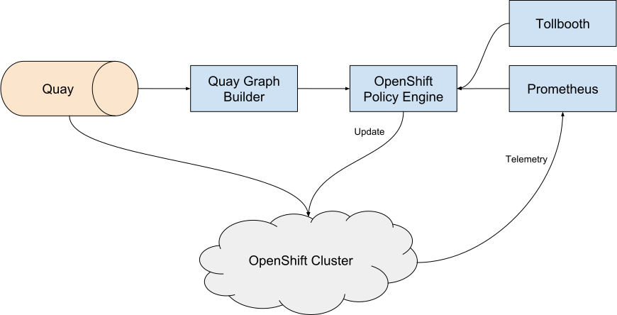
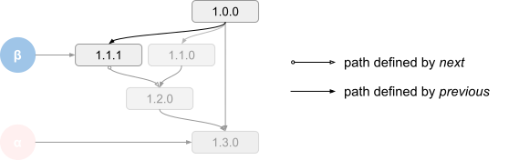
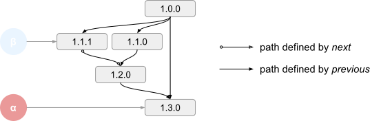
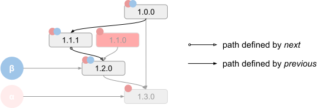
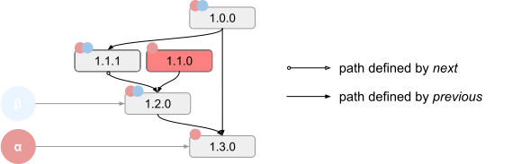

# Cincinnati in OpenShift #

OpenShift will make use of the [Cincinnati update scheme](cincinnati.md) to provide over-the-air updates to all clusters. Because Cincinnati is a generic scheme, OpenShift specifics will need to be defined. This document serves to document those specifics, which include: the Quay Graph Builder, OpenShift Policy Engine, update payload format, and client update protocol.

<figure align="center">
  
  <figcaption>Figure 1: An overview of the relationships between the Cincinnati components within OpenShift</figcaption>
</figure>


## Key Decisions ##

* **Payloads declare transitions** - In order to ensure the integrity of updates, the declared transitions (a window into the overall DAG) should remain a part of the update payload. Coupling the declaration of valid transitions allows the client to validate that the update was intended for the currently running release. This also makes the future maintenance of a project easier if the DAG can be committed alongside the code. This coupling is the result of the fact that the DAG is really just an easy-to-parse declaration of the intention of the implementation.
* **Decouple payload delivery** - By decoupling the payload delivery mechanism from Cincinnati, it allows many different forms of payload and their delivery to be supported. The Cincinnati server is able to provide metadata about payloads in a uniform manner but leaves the retrieval up to each of the clients.
* **Payload availability declared in Quay** - Using Quay’s image labels to annotate images allows Quay to be treated as the sole source of truth for the Graph Builders.
* **Payload digest and signature is self contained** - If the payload contains its digest and signature, the cluster will be able to verify the authenticity of the payload without any additional metadata. This is a requirement for offline installations since clusters in these environments won’t communicate with the root Policy Engines.
* **Each graph API endpoint represents a single product** - All of the versions and channels in a graph are expected to refer to a related set of content, and all payloads can be assumed to be related.


## Update Process ##

The Cluster Version Operator (CVO), an instance of which runs in every cluster, is in charge of performing updates to the cluster. It does this primarily by updating the manifests for all of the Second-Level Operators (SLOs).

The Cluster Version Operator, like all operators, is driven by its corresponding Operator custom resource. This custom resource reports the next available updates considered by the CVO and controls which update the CVO actually applies, whether or not this is done automatically, and the upstream Policy Engine (among other options). This allows the cluster updates to be driven both by the console and by an admin modifying the custom resource manually. This also allows the admin to direct the CVO to their own Policy Engine, possibly running within the cluster itself.

The series of steps that the Cluster Version Operator follows is detailed below:

1. CVO sleeps for a set duration of time plus some jitter.
2. CVO checks in to the upstream Policy Engine, downloading the latest update graph for the channel to which it’s subscribed.
3. CVO determines the next update(s) in the graph and writes them to the "available updates" field in its Operator custom resource.
    1. If there are no updates available, CVO goes back to step 1.
4. If automatic updates are enabled, CVO writes the newest update into the "desired update" field in its Operator custom resource.
5. CVO waits for the "desired update" field in its Operator custom resource to be set to something other than its current version.
6. CVO instructs the local container runtime to download the image specified in the "desired update" field.
7. CVO validates the digest in the downloaded image and verifies that it was signed by the private half of one of its hard coded keys.
    1. If the image is invalid, it is removed from the local system and CVO goes back to step 1.
8. CVO validates that the downloaded image can be applied to the currently running version by inspecting `release-metadata`.
    1. If the image cannot be applied, it is removed from the local system and CVO goes back to step 1.
9. CVO applies the deployment for itself, triggering Kubernetes to replace CVO with a newer version.
10. CVO applies the remainder of the deployments from the downloaded image, in order, triggering the SLOs to begin updating.
11. CVO waits for all of the SLOs to report that they are in a done state.
12. CVO goes back to step 1.


## OpenShift Policy Engine ##

The Policy Engine used by OpenShift is responsible for selectively serving updates to every cluster. It uses a number of inputs to help shape the graph that is served to each client.


### Tollbooth ###

Tollbooth is an internal Red Hat service which can be used to associate a cluster with the customer who owns it. Whenever a cluster requests the update graph, Policy Engine looks up the customer by cluster ID and uses this to potentially influence the graph via metadata associated with the cluster, customer, or system as a whole. This may be used in the future to serve specific hotfixes to particular customers.


### Channels ###

Each OpenShift cluster subscribes to a particular channel of updates. Channels may be used to vary the frequency of updates and the stability of those updates. For example, updates may initially roll out to a "fast" channel and later roll out to a "slow" channel once the update is verified to be stable.

The Policy Engine represents these channels as a series of pointers to particular versions within the update graph. This pointer serves as a target version for all clusters on a particular channel. The following demonstrates how different clients would view the update graph:

<figure align="center">
  
  <figcaption>Figure 2: The view of the update graph from a client in the Beta channel</figcaption>
</figure>

<figure align="center">
  
  <figcaption>Figure 3: The view of the update graph from a client in the Alpha channel</figcaption>
</figure>

The graphs served by the Policy Engine will always have a single root node (equal to the cluster’s current version) and a single leaf node (equal to the channel target). There may be any number of nodes between the root and the leaf, so the Cluster Version Operator will choose the newest version if it encounters a choice. Because there is a single leaf in the graph, every choice is valid and won’t leave the cluster in a state where it cannot update to the channel target. Above, in Figure 3, the Cluster Version Operator will opt to update from `1.0.0` to `1.3.0` (because `1.3.0` is newer than `1.1.0` and `1.1.1`) but both `1.1.0` and `1.1.1` are also valid options.

Every release in the graph is annotated with its approved channels. In order for the update to be included in the graph for a particular channel, it must be approved for that channel. This is done to prevent a release destined for a less stable channel from being served to a cluster subscribed to a more stable channel. The following helps demonstrate this:

<figure align="center">
  
  <figcaption>Figure 4: The view of the update graph from a client in the Beta channel</figcaption>
</figure>

<figure align="center">
  
  <figcaption>Figure 5: The view of the update graph from a client in the Alpha channel</figcaption>
</figure>

Above, in Figure 4, the Beta channel does not include 1.1.0 in the update graph because it hasn’t been approved.
For example, this may be because a bug was discovered in 1.1.0 and fixed in 1.1.1 before rolling out to the Beta channel.
For release issues serious enough to warrent exclusion from the Beta channel, the Alpha-channel edge will also be removed to avoid funneling Alpha clusters to the degraded release.
However, the degraded release will remain in the Alpha channel to allow existing clusters to upgrade away from it.

### Client API ###

The policy engine client API conforms to the [Cincinnati Graph API](cincinnati.md#graph-api). The Cluster Version Operator running within the cluster will periodically call this client API to determine whether or not an update is available. The format of this request and response is detailed below.


#### Request ####

HTTP GET requests are used to fetch updates from the policy engine. Requests are made to `/v1/graph` and must include the following URL parameters:

|   Key   | Optional | Description                                                                                |
|:-------:|:--------:|:-------------------------------------------------------------------------------------------|
| arch    | optional | [the architecture identifier][image-config-properties] for the currently installed cluster |
| version | required | the version number of the currently installed cluster                                      |
| channel | required | the name of the channel to which this cluster is subscribed                                |
|   id    | required | the unique identifier (UUID v4) of the cluster                                             |
|    *    | optional | any other parameters will be passed to upstream requests                                   |

##### Example ######

An OpenShift cluster on the fast channel:

```
/v1/graph?version=4.0.3&channel=fast&id=ceb3b0bb-c689-4db9-bb6a-0122237e33fd
```


#### Response ####

The response from the policy engine will conform to the [Cincinnati Graph API response](cincinnati.md#response). The Cluster Version Operator will parse the graph from the response and choose the most recent version available.


## Update Format ##

### Update Payload ###

The Update Payloads served by Cincinnati to the Cluster Version Operator are formatted as a JSON document containing a reference to a container image. This document is versioned so that it may change over time. An example of this document is shown below:

```json
{
    "kind": "update.openshift.io/v0",
    "image": "quay.io/openshift/manifest:v4.0.0"
}
```

The image field references the Update Image which contains the actual update to be applied by the cluster.


## Update Image ##

The Update Image is a container image consisting of a series of Kubernetes manifests describing the Second-Level Operators (SLOs), the `release-metadata` file required by Cincinnati, and a manifest specific to OpenShift. In the future, this image may be expanded to include other assets.

The OpenShift manifest describes the format of the Update Image and provides a cryptographic signature of the surrounding image. The details of this manifest have not yet been finalized.

[image-config-properties]: https://github.com/opencontainers/image-spec/blob/v1.0.1/config.md#properties
